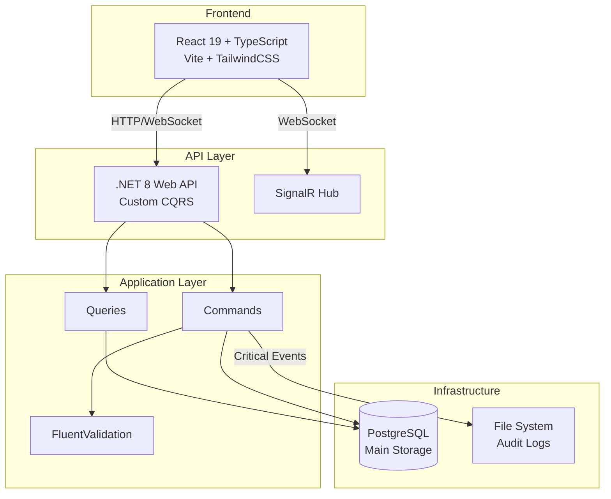

# Tasker - Advanced Task Management Application

## 📋 Project Overview

Tasker is a modern task management application built with Clean Architecture principles and Domain-Driven Design. It provides comprehensive task management capabilities with real-time updates, advanced filtering, and critical event tracking.

### Key Features
- Complete CRUD operations for task management
- Priority-based task organization (Low, Medium, High, Critical)
- Real-time status updates via SignalR
- Advanced filtering, search, and pagination with lazy loading
- Critical event logging for high-priority tasks (file-based)
- JWT-based authentication with refresh tokens
- Visual statistics with interactive charts
- Comprehensive validation and error handling

### Technology Stack
- **Backend**: .NET 8 Web API with custom CQRS implementation
- **Frontend**: React 19 with TypeScript and Vite
- **Database**: PostgreSQL with Entity Framework Core
- **Real-time**: SignalR for WebSocket communication
- **Infrastructure**: Docker Compose for containerization

## 🏗️ Project Structure

```
tasker/
├── api/                # .NET 8 Web API backend
│   └── src/
│       ├── Tasker.Api/             # Web API layer
│       ├── Tasker.Application/     # CQRS commands, queries, handlers
│       ├── Tasker.Domain/          # Domain entities and events
│       ├── Tasker.Infrastructure/  # Data access and external services
│       ├── Tasker.Shared/          # Custom mediator implementation
│       └── Tasker.Shared.Abstractions/ # Shared interfaces
├── web/                # React frontend application
├── deploy/             # Docker Compose deployment
└── api/tests/          # Unit and integration tests
```

### Documentation
- [API Documentation](./api/README.md) - Backend architecture and endpoints
- [Web Documentation](./web/README.md) - Frontend features and setup
- [Deployment Documentation](./deploy/README.md) - Docker deployment guide

## 🚀 Quick Start

### Option 1: Full Stack with Docker Compose (Recommended)

Start the entire application stack including databases, API, and web frontend:

```bash
cd deploy

# Build images (required on first run)
docker compose build

# Start all services
docker compose up -d
```

Access the application:
- **Web Application**: http://localhost:3000
- **API Swagger**: http://localhost:5080/swagger
- **PostgreSQL**: localhost:5432

### Option 2: Local Development Setup

For development with hot-reload and debugging:

#### 1. Start Infrastructure Services
```bash
cd deploy
docker compose -f docker-compose.infra.yml up -d
```

This starts:
- PostgreSQL on port 5432
- PgAdmin on port 5050 (optional)

#### 2. Run the API from your favorite IDE or:
```bash
cd api
dotnet restore
dotnet run --project src/Tasker.Api
```

The API will be available at http://localhost:5080

#### 3. Run the Web Application
```bash
cd web
npm install
npm run dev
```

The web application will be available at http://localhost:3000

## 📋 Implementation Status

### Backend Features ✅
- **Custom CQRS Pattern**: In-house mediator implementation (not MediatR)
- **Commands**: CreateTask, UpdateTask, DeleteTask
- **Queries**: GetTaskById, GetTasksPaged, GetTaskStats
- **Validation**: FluentValidation with pipeline behaviors
- **Repository Pattern**: Clean separation of data access
- **Event Handling**: High-priority task changes tracked
- **Critical Event Logging**: File-based audit trail via Serilog
- **Request Logging**: Custom middleware with Serilog
- **JWT Authentication**: Login, Register, RefreshToken endpoints
- **SignalR Hub**: Real-time notifications for task changes
- **Rate Limiting**: Built-in .NET 8 per-IP limiting
- **Database**: PostgreSQL with Entity Framework Core
- **Migrations**: Automatic migration on startup
- **Data seeding**: Automatic data seeding on startup

### Frontend Features ✅
- **React 19 with TypeScript**: Modern component architecture
- **Lazy Loading**: Infinite scroll for task lists
- **Real-time Updates**: SignalR integration for live data
- **Visual Statistics**: Recharts for task analytics
- **Advanced Filtering**: Status, priority, search with debouncing
- **Form Validation**: React Hook Form with Zod schemas
- **Authentication Flow**: Protected routes with JWT handling
- **UI Components**: Radix UI with Tailwind CSS styling
- **State Management**: TanStack Query for server state
- **Dark Mode Support**: Theme switching capability

## 🛠️ Development

### Prerequisites
- **.NET 8 SDK** - [Download](https://dotnet.microsoft.com/download/dotnet/8.0)
- **Node.js 20+** - [Download](https://nodejs.org/)
- **Docker & Docker Compose** - [Download](https://www.docker.com/)
- **IDE**: Visual Studio, VS Code, or JetBrains Rider

### Environment Configuration

The application uses the following configuration:

```yaml
# Database Connection
ConnectionStrings:
  Postgres: Host=localhost;Database=tasker;Username=tasker;Password=tasker

# JWT Settings
Jwt:
  SigningKey: your-secret-key-at-least-32-characters-long
  Issuer: TaskerAPI
  Audience: TaskerClient
  ExpiryMinutes: 60

# Logging
Serilog:
  MinimumLevel:
    Default: Information
  WriteTo:
    - Name: File
      Args:
        path: logs/requests.log
        rollingInterval: Day
```

## 📊 Architecture Overview



## 🧪 Testing

### Running API Tests from your IDE or:
```bash
cd api
dotnet test
```

Test projects:
- `Tasker.Application.Tests` - Unit tests for handlers and validation

## 🔒 Authentication

The application uses JWT authentication with refresh tokens:

1. **Register**: Create new user account
2. **Login**: Authenticate and receive access/refresh tokens
3. **Protected Routes**: All task operations require authentication
4. **Token Refresh**: Automatic token renewal using refresh tokens

## 📡 Real-time Features

SignalR provides real-time updates for:
- `TaskCreated` - New task notifications
- `TaskUpdated` - Task modification alerts
- `TaskDeleted` - Task removal notifications
- `HighPriorityTaskChanged` - Critical task updates

## 🚦 Monitoring

### Logging
- **Request Logs**: `logs/requests.log` (Info level)
- **Critical Events**: `logs/critical.log` (Warning+ level)
- **Console Output**: Development environment logging

### Health Checks
- PostgreSQL: Connection validation
- API: Health endpoint

---

Built with Clean Architecture, Custom CQRS, and Modern Web Technologies
